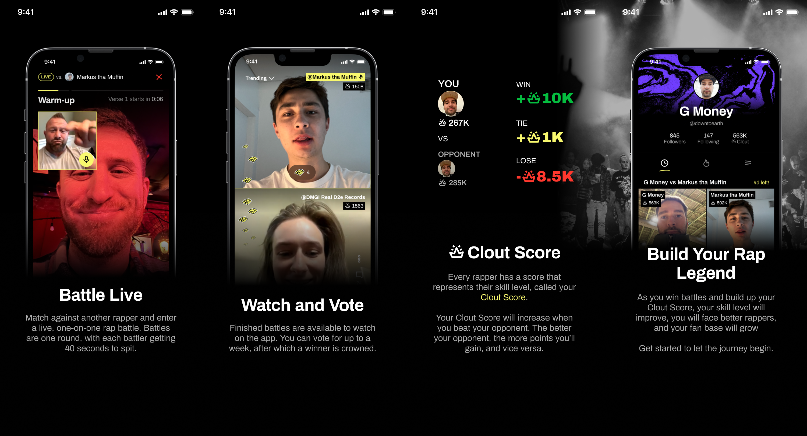

# Barz

Barz is an application for virtual rap battling - a structured video call experience where each
user takes a turn rapping over a backing beat. Users can be matched based on their score or
challenge other users directly. A slew of social networking features provide ways for communities of
like minded battlers to form.

## Engineering Overview
Barz is split into a few different subprojects, all contained within this source tree. Here is a
list of all subprojects, as of late september 2023:
- `apps/mobile`: The Barz mobile app, built with expo / react native.
- `apps/server`: The Barz web server that powers interactive battling and stores all social
  networking related data.
- `packages/barz-twilio-video`: A heavily modified fork of
  [react-native-twilio-video-webrtc](https://github.com/blackuy/react-native-twilio-video-webrtc)
  that ports it to use expo modules, fixes a number of bugs, and most importantly, allows a backing
  track to be played within the video call.
- `apps/elo-demo`: A small react application that can be used to experiment / troubleshoot the elo
  scoring system used by barz. A built and hosted version is hosted at
  [https://barz-elo-demo.surge.sh/](https://barz-elo-demo.surge.sh/).
